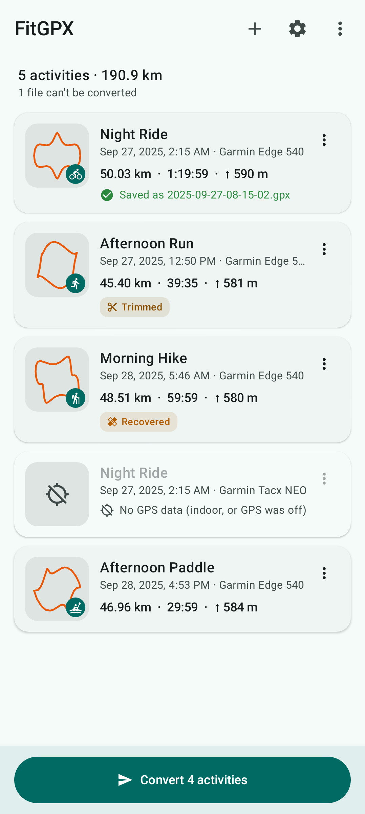
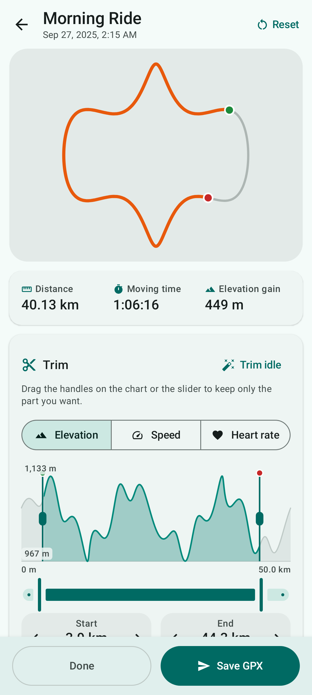
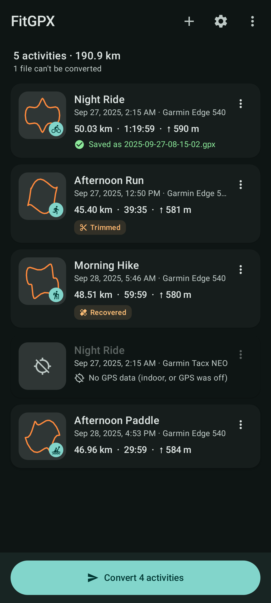

<div align="center">


# FitGPX

**Convert FIT activity files to GPX on Android: one or a thousand at a time. Trim them and hide your home, all offline.**

[](https://github.com/phil-tomlinson/fitgpx/actions/workflows/ci.yml)
[](LICENSE)
[](https://github.com/phil-tomlinson/fitgpx/releases)


</div>

Garmin, Wahoo, Coros, Hammerhead, Bryton, Zwift and almost every other fitness device record activities as
binary **`.fit`** files. Most mapping, route-planning and analysis tools want **`.gpx`**. FitGPX converts one to
the other on your phone, without an account or a server, and without sending your location anywhere.

<p align="center">
  
  &nbsp;
  
  &nbsp;
  
</p>

## Features

- **Batch conversion.** Pick many files, a whole folder, a **Garmin Connect export (`.zip`)** or a
  **Strava bulk export** (`.fit.gz` inside a `.zip`). Archives are streamed, so multi-gigabyte exports work on
  a phone.
- **Trim editor.** Drag handles on an elevation, speed or heart-rate profile, or on the map, to keep only the
  part you want. You can also nudge point by point, or use *Trim idle* to cut the café stop at the start and finish.
- **Privacy.** Add **privacy zones** (home, work) that are removed from every export. You can also hide the
  first or last N metres, or drop timestamps entirely to share a route anonymously.
- **Full fidelity.** Elevation, time, **heart rate, cadence, power and temperature** are written as Garmin
  TrackPointExtension/PowerExtension, the GPX dialect Strava, Garmin Connect, Komoot, Ride with GPS,
  OsmAnd and GoldenCheetah all read. Course files keep their **course points** (turns, climbs, water stops)
  as waypoints.
- **Robust.** Recovers GPS data from files left **truncated by a crash or flat battery**, handles compressed
  timestamps, developer fields, big-endian devices, chained files and multisport (one track per leg).
- **Clean output.** Optional GPS-spike removal, split at pauses, line simplification and coordinate precision.
  Every file validates against the official GPX 1.1 schema.
- **Save anywhere.** Write to a folder you choose once, bundle into a ZIP, or share straight to another app.
  Open `.fit` files from a file manager or share them from Garmin Connect.
- **Private by design.** No accounts, no analytics, no ads, no storage permission. The map, which uses
  OpenStreetMap tiles, is the only network access, and you can turn it off.
- Material 3 design with light/dark themes, dynamic color, metric/imperial units, and screen-reader labels.

## Download

| Channel | Status |
|---|---|
| **GitHub Releases** | Signed APKs on the [Releases page](https://github.com/phil-tomlinson/fitgpx/releases) |
| **Obtainium** | Add `https://github.com/phil-tomlinson/fitgpx` to get updates straight from GitHub |
| **F-Droid** | Planned. The repo already has fastlane metadata and reproducible-build settings |

Each release lists the SHA-256 of the signing certificate so you can verify the APK.

## Command-line converter

The same engine ships as a desktop CLI (Java 17+). It's handy for converting a whole archive on a computer:

```sh
java -jar fitgpx-cli.jar -o gpx/ --name "{date}_{sport}" --hide-start 200 \
     --privacy 51.0447,-114.0719,250 ~/Downloads/export_12345678.zip
```

Run `java -jar fitgpx-cli.jar --help` for all options.

## How it works

```
 .fit / .fit.gz / .zip ──► InputUnpacker ──► FitDecoder ──► ActivityReader ──► TrackProcessor ──► GpxWriter ──► .gpx
                          (streaming,       (clean-room     (records, laps,   (trim, privacy,    (GPX 1.1 +
                           bomb-safe)        binary FIT)     sessions, pauses)  simplify, split)   Garmin exts)
```

- **`fit-core/`** is a dependency-free Kotlin/JVM library holding the whole conversion engine. It's written
  from the public FIT protocol description and uses no Garmin SDK code. Its tests compare every decoded point
  against an independent decoder and validate the GPX output against the official XSD schemas.
- **`app/`** is the Android app (Jetpack Compose, Material 3, osmdroid for maps).
- **`cli/`** is the desktop command-line front end.

The full design, build and deployment plan is in **[docs/PLAN.md](docs/PLAN.md)**.

## Building

Requirements: JDK 17+ and the Android SDK (or Android Studio).

```sh
./gradlew :fit-core:test               # engine tests (no Android needed)
./gradlew :app:assembleDebug           # debug APK in app/build/outputs/apk/debug/
./gradlew :app:testDebugUnitTest       # app unit tests
./gradlew :app:recordRoborazziDebug    # re-render UI screenshots
./gradlew :cli:fatJar                  # cli/build/libs/fitgpx-cli.jar
```

## Contributing

Bug reports with a sample file are the most valuable contribution: see
[CONTRIBUTING.md](CONTRIBUTING.md). Translations, device-specific fixes and ideas are all welcome.

## License

FitGPX is free software under the [GNU General Public License v3.0 or later](LICENSE).
Map data © [OpenStreetMap](https://www.openstreetmap.org/copyright) contributors.
Test fixtures in `fit-core/src/test/resources/fit` come from [python-fitparse](https://github.com/dtcooper/python-fitparse) (MIT).
FIT is a protocol by Garmin; FitGPX is not affiliated with or endorsed by Garmin.
